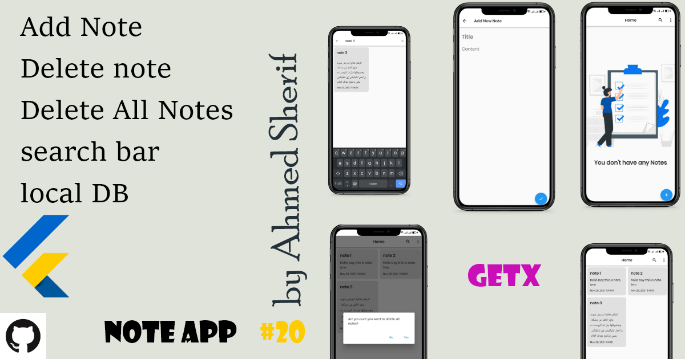
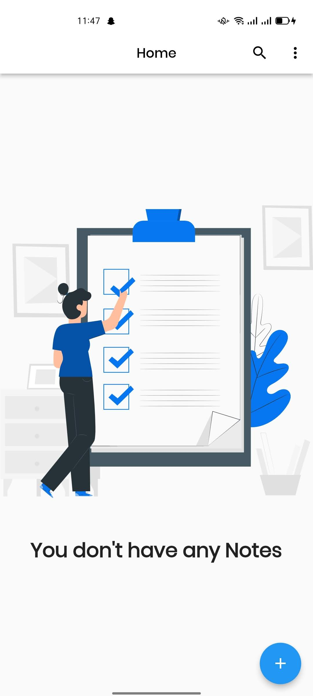
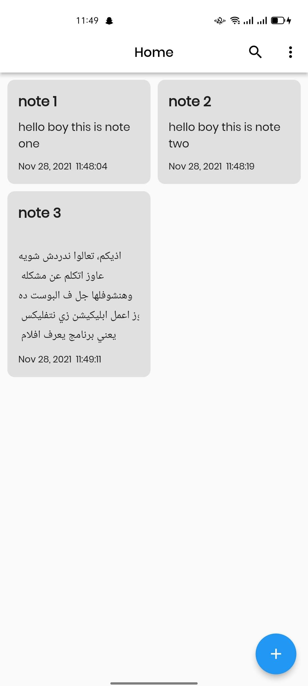
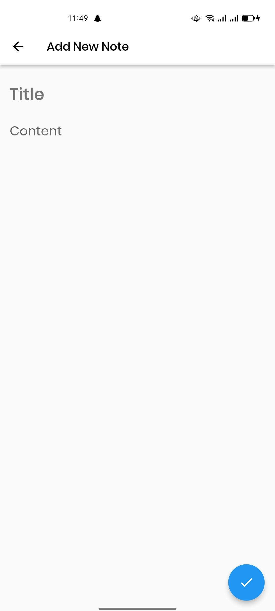
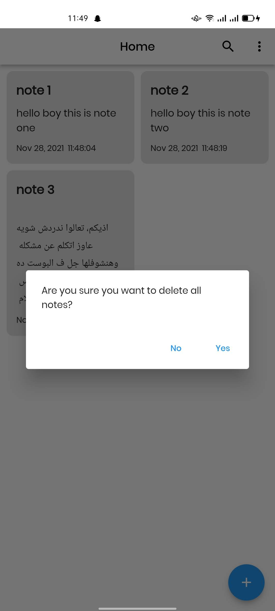
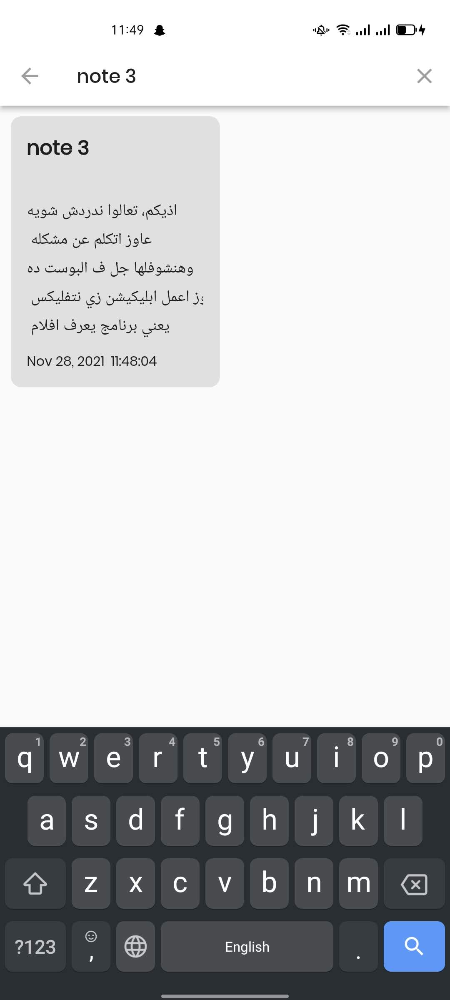

# Note App ✍🏻
Note App & SqfLite &GetX [MVC pattern] 👨🏻‍💻

Note app is open-source notes app for Android & ios. It is built with Dart on top of Google's Flutter Framework.

بص بقي يمعلم 👀 ده برنامج نوت يعني تدخل عليه تكتب النوتس المهمه بالنسبالك وكل نوته هيكون ليها عنوان مخصص ليها عشان تقدر تبحث عنها طيب لو معملتش عنوان هتتسمي لوحدها بدون عنوان تمم يبقي ساعتها تبحث عن المحتوي نفسه مش العنوان تمم تمم
اه ودا مش ابليكيشن تكلم نفسك عليه وتجلد ذاتك وشغل توحد الله يهديك


<p></p>
<p align="center"><b>Note App</b></p>

##:rocket: youtube Tutorial
 
- Note App by GetX Link: [Note](https://www.youtube.com/watch?v=MFjoIT3RJSc&list=PLI36SLicSOmKQMPwPauvWDARjzrlQyLIo&index=21&ab_channel=SecitDevelopers)
- news App Api by GetX Link: [News](https://www.youtube.com/watch?v=MFjoIT3RJSc&list=PLI36SLicSOmKQMPwPauvWDARjzrlQyLIo&index=21&ab_channel=SecitDevelopers)
- Ecommerce App by GetX Link: [MakeUp](https://www.youtube.com/watch?v=-bwiujixOpU&list=PLI36SLicSOmKQMPwPauvWDARjzrlQyLIo&index=3&ab_channel=SecitDevelopers)
- GetX EcoSystem playList Link: [PlayList](https://www.youtube.com/watch?v=8Jy4dtQOZMQ&list=PLI36SLicSOmKQMPwPauvWDARjzrlQyLIo&index=1)


## About🤠

Note app using GetX and local database (sqflite) can add note and remove it
can remove all notes can update note & share it to your social

## Benfit👻
- [🆗] Welcom Screen
- [🆗] Home Screen
- [🆗] Add New Note Page
- [🆗] Edited Note Page
- [🆗] Note Detail Page
- [x] [GetX]
- [x] MVC patterns
- [x] Deal with Search Delegate .
- [x] Deal With Alert Dialog
- [x] Content Word Count 
- [x] Content Char Count 
- [x] Share Note to Social media
- [x] if you don't add title defultly be UnNammed
- [x] Deal with Sqflite.
- [✅] Create Note
- [✅] Update Note
- [✅] delete note
- [✅] delete All note
- [✅] Search about notes
- [✅] Last Update of Note
- [✅] Date Time Created of Note

## Snapshots

| Welcom Screen | Home Screen |
|------|-------|
|||

| Note Page | Delete Dialog|
|------|-------|
|||

| Search Bar
|------
|


## Other Flutter Projects 🔐 
- [News App](https://github.com/itsherifAhmed/NewsApp)
- [Device Detail App](https://github.com/itsherifAhmed/device-detail-app)
- [White board Draw App](https://github.com/itsherifAhmed/draw-app)
- [music app player external storage read](https://github.com/itsherifAhmed/Music-Player-Read-external-Storage-Flutter-app)
- [Make Up App flutter MVC Getx](https://github.com/itsherifAhmed/MakeUp-App)
- [Speech to Text app flutter](https://github.com/itsherifAhmed/Speech-to-text-app)
- [api flutter project](https://github.com/itsherifAhmed/apiFlutter-Project)
- [qr code app](https://github.com/itsherifAhmed/qr-barcode)
- [facebook ui clone](https://github.com/itsherifAhmed/facebook-ui-clone)
- [Login Screen](https://github.com/itsherifAhmed/login-screen)


## Dependencies 💤
 -  `get: ^4.3.8`
 -  `google_fonts: ^2.1.0`
 -  `sqflite: ^2.0.0+4`
 -  `path_provider: ^2.0.7`
 -  `intl: ^0.17.0`
 -  `string_stats: ^0.0.3`
 -  `flutter_staggered_grid_view: ^0.4.1`
 -  `share: ^2.0.4`
 -  `lottie: ^1.2.1`
 -  
## Directory Structure
```
lib
    │───main.dart
    |   
    │───model
    |    └──Note_model
    |
    │───view
    |    │──add_new_note_page.dart
    |    │──edit_note_page.dart
    |    │──home_page.dart
    |    └──note_detail_page.dart
    │───controller
    |    └──note_controller.dart
    └───helper
    |     └──database_helper
    |     
    │───Wedgets
         └─alarm_dialog.dart
         └─searchbar.dart

    
```
